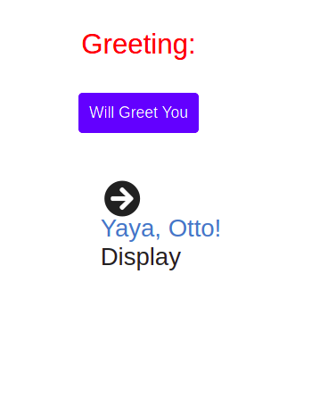

# HELLO RAILS REACT APP

 A project using the `react-rails` gem to build React components as a part of Rails JavaScript and serve it in a component, react_component, used in a regular ERB file.

## Built with

- React
- Ruby on Rails
- Visual Studio Code
- Lots of love :heart:

## Screenshot



## Run Tests

```
rails s
```

## Author:

 **Toluwase Ajise**

[<code></code>](https://github.com/whoistolu)
[<code></code>](https://twitter.com/Littletolu)
[<code></code>](https://www.linkedin.com/in/toluwase-ajise-9b40411b2/)
<a href="digittolu25@gmail.com?subject=Hello Tolu!"></a>

##  Contributing

Contributions, issues and feature requests are welcome!

Feel free to check the [issues page](https://github.com/Whoistolu/Hello-Rails-React/issues).

## Show your support

Give a 👍 if you like this project!

## Acknowledgments

- Microverse

## 📝 License

This project is [MIT](./LICENSE.md) licensed.
